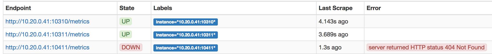

# Prometheus inception exporter [][travis]

Export exporters states (aka. targets) to Prometheus. In order to setup alerting on exporter status.

To run it:

```bash
make
./prometheus_inception_exporter [flags]
```

or

```bash
go get github.com/samber/prometheus-inception-exporter
prometheus_inception_exporter [flags]
```

## Why

You need alerting to detect exporters failures:



## Exported Metrics

| Metric | Meaning | Labels |
| ------ | ------- | ------ |
| metrics_namespace_target_count | Number of exporter currently up or down (except removed targets). | |
| metrics_namespace_target_state | Current state of each exporter. | {job_name: cadvisor,sd,custom..., scrape_url: https://postgresql-exporter.acme.io:9123/metrics } |

### Example:

```
$ curl localhost:9142/metrics
# HELP prometheus_inception_target_count Number of targets on Prometheus instance instance
# TYPE prometheus_inception_target_count gauge
prometheus_inception_target_count 141
# HELP prometheus_inception_target_state Prometheus targets state
# TYPE prometheus_inception_target_state gauge
prometheus_inception_target_state{job="nginx-web",scrape_url="http://10.42.0.1:9123/metrics"} 1
prometheus_inception_target_state{job="nginx-web",scrape_url="http://10.42.0.2:9123/metrics"} 0
prometheus_inception_target_state{job="nginx-web",scrape_url="http://10.42.0.3:9123/metrics"} 1
prometheus_inception_target_state{job="nginx-api",scrape_url="http://10.42.0.1:9124/metrics"} 1
prometheus_inception_target_state{job="nginx-api",scrape_url="http://10.42.0.2:9124/metrics"} 1
prometheus_inception_target_state{job="nginx-api",scrape_url="http://10.42.0.3:9124/metrics"} 0
prometheus_inception_target_state{job="postgresql",scrape_url="http://10.42.0.2:9125/metrics"} 0
prometheus_inception_target_state{job="redis",scrape_url="http://10.42.0.2:9126/metrics"} 2
```

state to 0: exporter down
state to 1: exporter up
state to 2: scrapping configuration removed from prometheus.yml

### Flags

```bash
./prometheus_inception_exporter --help
```

* __`-log.format`:__ If set use a syslog logger or JSON logging. Example: `logger:syslog?appname=bob&local=7` or `logger:stdout?json=true`. Defaults to stderr`.
* __`-log.level`:__ Only log messages with the given severity or above. Valid levels: `[debug, info, warn, error, fatal]`. (default `info`)
* __`-timeout`:__ Timeout for trying to get states from Prometheus. (in seconds, default 5s)
* __`-prometheus.address`:__ HTTP API address of a Prometheus instance. (default `http://localhost:9090`)
* __`-prometheus.basic_auth.username`:__ Basic-auth username of a Prometheus instance. (default: none)
* __`-prometheus.basic_auth.password`:__ Basic-auth password of a Prometheus instance. (default: none)
* __`-version`:__ Print version information.
* __`-web.listen-address`:__ Address to listen on for web interface and telemetry. (default `:9142`)
* __`-web.telemetry-path`:__ Path under which to expose metrics. (default `/metrics`)

## Prometheus scrapping configuration

Add this to your prometheus.yml:

```
global:
  scrape_interval: 15s
  evaluation_interval: 15s

scrape_configs:

[...]

  - job_name: 'connectors-webhook-collector-job'
    scrape_interval: 5s
    scrape_timeout: 3s
    static_configs:
      - targets: ['94.125.164.108:10960']

[...]

```

## Alerting configuration

```
ALERT ExperterDown
  IF prometheus_inception_target_state{} == 0
  FOR 1m
  LABELS { severity="slack" }
  ANNOTATIONS {
    summary = "Prometheus exporter DOWN",
    to = "@channel",
    description = "Failed to scrape {{ $labels.job_name }} at {{ $labels.scrape_url }} -- see https://prometheus.acme.io:9090/targets",
  }
```

## Using Docker

You can deploy this exporter using the [samber/prometheus-inception-exporter](https://registry.hub.docker.com/u/samber/prometheus-inception-exporter/) Docker image.

For example:

```bash
docker pull samber/prometheus-inception-exporter

docker run -d -p 9142:9142 samber/prometheus-inception-exporter -prometheus.addr=https://prometheus.acme.io:9090 -prometheus.basic_auth.username=foo -prometheus.basic_auth.username=bar
```


[hub]: https://hub.docker.com/r/samber/prometheus-inception-exporter
[travis]: https://travis-ci.org/samber/prometheus-inception-exporter
